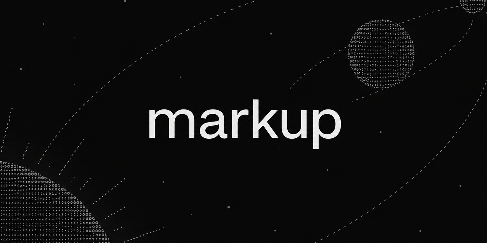
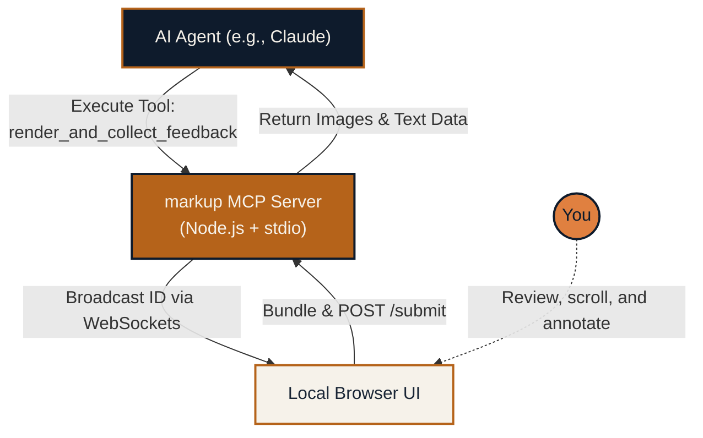

# markup



**A localized visual feedback loop for AI coding agents.** 

`markup` is a standalone Model Context Protocol (MCP) server that seamlessly bridges the gap between what an AI agent generates and what you actually see. Instead of manually copying and pasting descriptions of UI flaws, `markup` injects a lightweight, scroll-aware comment interface directly on top of the rendered HTML. You visually point out the issues, and the agent automatically receives pixel-perfect screenshots and your exact annotations.

---

## The Core Problem

Right now, iterating on frontend code with an AI is a tedious, multi-step process:
1. The agent writes HTML/CSS.
2. You open it, spot an alignment issue, and realize you have to explain it in text.
3. You switch back to your terminal or chat window and try to articulate "the blue button is overlapping the header text by about 10 pixels."
4. The agent tries again.

**`markup` eliminates this entire cycle.** When the agent wants to show you something, it calls the `render_and_collect_feedback` tool. The agent goes to sleep, your browser pops open, and you simply type your feedback directly onto the page. Once you hit submit, the agent wakes back up with precisely cropped screenshots and context-rich text blocks.

## Getting Started

Because `markup` operates as a local-first service without relying on external cloud dependencies, installation is as simple as cloning the repository:

```bash
git clone git@github.com:async-ar15/markup.git
cd markup
bash scripts/install.sh
```

The installation script automatically registers the MCP server in your global configuration. This means you can trigger `markup` from **any directory** or **any project** you are actively working on using Claude Code or similar MCP-compatible agents.

To activate the new tool, simply run `/mcp` in your active Claude Code session to reload the environment.

## System Architecture



### Feature Highlights
- **Viewport-Aware Grouping**: If you write multiple comments in the same general area of the page, `markup` smartly groups them into a single screenshot region to save tokens and context space.
- **Agent Pausing**: The tool uses an indefinite long-poll strategy, ensuring the agent doesn't hallucinate or move on while you are taking your time reviewing the UI.
- **Resilient Captures**: Powered by a modernized fork of `html2canvas`, it perfectly captures advanced CSS features like `color-mix()` and `oklch()`.
- **Failsafe Delivery**: If a specific DOM node crashes the rendering engine, it degrades gracefully to a transparent 1x1 image, ensuring your written feedback is *always* delivered to the agent regardless.

## Project Setup Options

### 1. Global Mode (Recommended)
This is what the `scripts/install.sh` handles. It allows the server to boot up on-demand for any session on a designated port (starting by default at `13847`).

### 2. Isolated Mode
If you prefer not to pollute your global configuration, bypass the install script entirely. Instead, create an `.mcp.json` file inside your specific project directory:

```json
{
  "mcpServers": {
    "markup": {
      "command": "/path/to/markup/node_modules/.bin/tsx",
      "args": ["/path/to/markup/src/index.ts"]
    }
  }
}
```

## Environment Configuration

`markup` is designed to run with zero configuration, but you can customize the networking if necessary:

| Variable | Default Value | Description |
|---|---|---|
| `MARKUP_PORT` | `13847` | The primary port the HTTP/WebSocket server will bind to. Will gracefully auto-increment if the port is busy. |
| `PORT` | `undefined` | A secondary fallback if `MARKUP_PORT` is not explicitly set. |

*Note: All generated artifacts and temporary screenshots are safely stored locally in your `~/.markup/` directory.*

## Common Issues & Fixes

- **Agent cannot find the tool**: If you moved the repository folder to a new location on your hard drive, the absolute paths in your MCP config are now broken. Simply run `bash scripts/install.sh` again to update them.
- **The tool returns a `PORTAL_BUSY` error**: `markup` only allows one active artifact session at a time to prevent conflicts. You likely have a previous browser tab still waiting for you to submit your feedback.
- **Blank Viewer Screen**: Check your agent's stderr logs. Ensure the agent is actually generating self-contained, valid HTML documents rather than fragmented snippets.

## Developer Reference

For contributors looking to modify or extend `markup`:

```bash
npm install
npm run dev           # Boot the MCP server via stdio and start HTTP on :13847
npm test              # Execute the core automated testing suite
node tests/demo.mjs   # Run a fully interactive visual simulation
npx tsc --noEmit      # Validate TypeScript types
```

## Tech Stack Overview
Built with **Node 20+**, **TypeScript**, and the official **@modelcontextprotocol/sdk**. Real-time browser syncing is handled via **ws** (WebSockets), and image generation uses **html2canvas-pro**. The frontend viewer requires zero build steps—it is a single, pure HTML/CSS/JS file.

## License & Credits

Distributed under the MIT License. See `LICENSE` for more information.

---
*Created by [Aman Rajput](https://github.com/async-ar15)*
